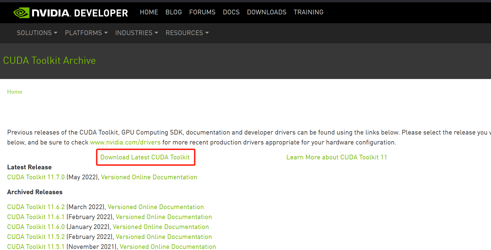
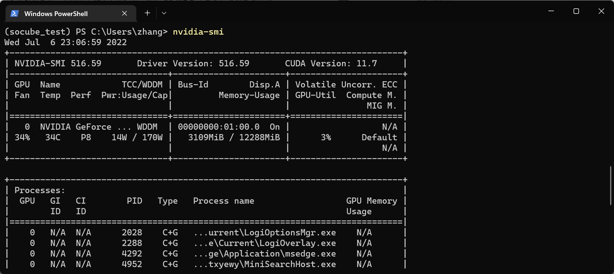
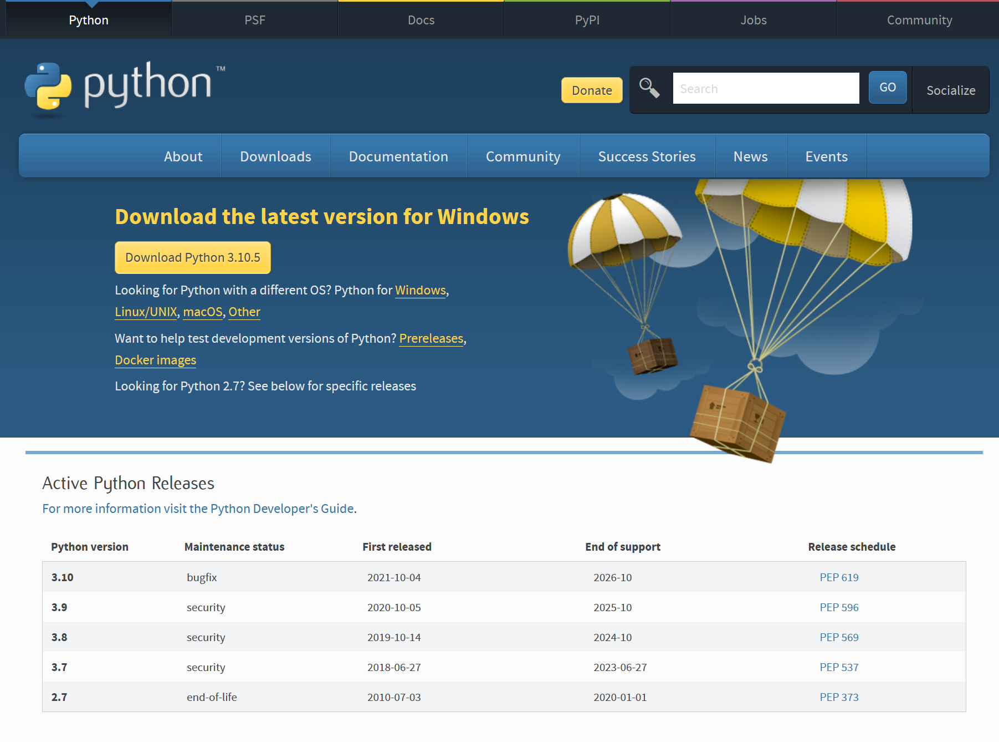
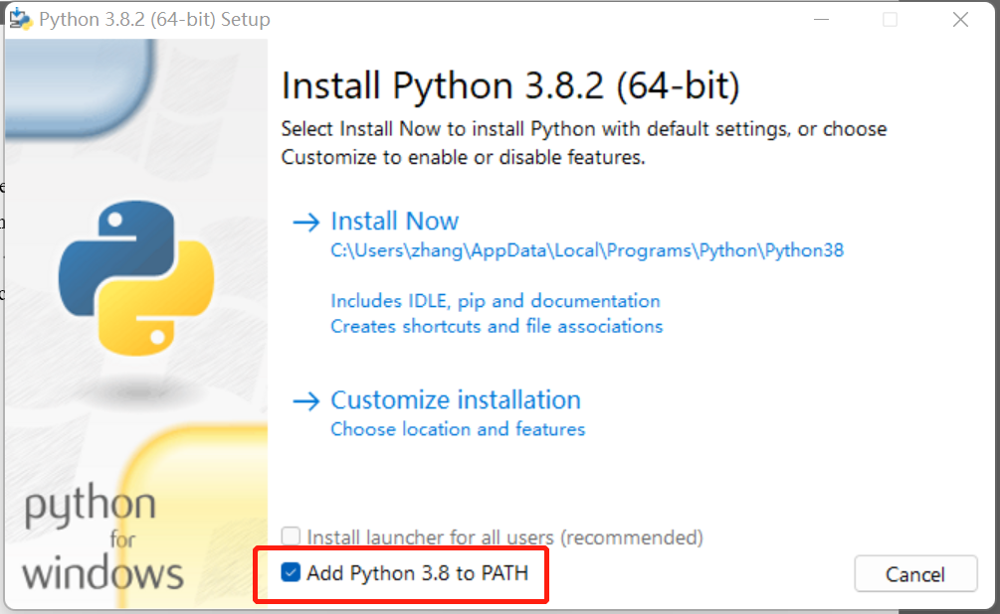
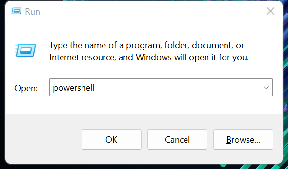

# Installation

## 3.1 CUDA Installation

SoCube is developed based on deep convolutional neural networks, and we strongly recommend users to use GPU accelerated computation in an environment with NVIDIA GPU and NVIDIA CUDA compute suite. For having a CUDA-supported NVIDIA GPU, users first need to install CUDA, which can be downloaded and installed from [NVIDIA](https://developer.nvidia.com/cuda-toolkit-archive).



After the installation is completed, users can enter "nvidia-smi" in the terminal to view their graphics card information and CUDA version information, as shown below, the graphics card is GeForce RTX 3060, the driver version is 516.59, CUDA version is 11.7.

```powershell
nvidia-smi
```



## 3.2 SoCube Installation



```bash
pip install socube # pip installation
socube -v # check the installed version
```

SoCube has been packaged and published to the Python official repository [PyPi](https://pypi.org/project/socube/). Users can open a terminal (such as Windows PowerShell, Bash, etc.) and use the pip command to install it. For users in China, it is recommended to use the [Tsinghua University mirror](https://mirrors.tuna.tsinghua.edu.cn/help/pypi/) to accelerate the download during installation. The following uses the Windows operating system as an example.

### 1. Python Installation

SoCube is a software developed based on Python, and it needs  Python interpreter to run the software. Users could download Python from [Python official website](https://www.python.org/getit/).



As shown below, follow the installation package prompts to install Python and check the box to add Python to the PATH environment variable (this environment variable defines the search path for terminal commands; if you do not add it, you cannot use Python directly in the terminal).



### 2. Access to terminal command environment

Pip is a package manager provided by Python to download all kinds of packages developed by Python, but it needs to be used in a terminal. Two kinds of terminals are provided under Windows, Windows PowerShell and Cmd, we recommend using PowerShell. use "Win+R " shortcut and run powershell to quickly enter PowerShell terminal.



### 3. Execute the pip command to install

Execute the aforementioned command in the terminal to install SoCube V1.0, which is recommended for users in China to use the Tsinghua University mirror to accelerate software download. When you see "Successfully installed \*\*\* socube-1.0" , it means the download and installation are successful. After successful installation, continue to enter `socube -v` in the current terminal to see the software version. The -i parameter is recommended for users in China (https://pypi.tuna.tsinghua.edu.cn/simple/).

```bash
pip install socube==1.1 -f https://pypi.tuna.tsinghua.edu.cn/simple/
```
### 4. Notes on PyTorch

Although PyTorch is automatically installed when executing `pip install socube`, versions provided by some mirror sites may be CPU-only version, so users are advised to check if the installed version supports GPU (`torch.cuda.is_available()` will be `True` when GPU and CUDA are properly configured). It is recommended to download torch from the [PyTorch official website](https://pytorch.org/get-started/locally/).

```bash
pip install torch==1.8.1+cu111 torchvision==0.9.1+cu111 -f https://download.pytorch.org/whl/torch_stable.html
```



```bash
sudo docker pull gcszhn/socube:latest
```

Docker is a containerized technology that isolates software in a sandbox, named as container. Containers are isolated from the physical device (named as container's host) and from the containers to each other. A container has the complete software environment in which the application runs and does not depend on the host software environment at all. Containers can be published as images and shared between devices with docker installed without additional installation. SoCube's docker image have been built and published on [Docker Hub](https://hub.docker.com/repository/docker/gcszhn/socube). Users who already have docker installed can obtain SoCube by executing the above command in the terminal. In addition, users can package a custom docker image of their own, with open-source Dockerflie.
```bash
git clone https://github.com/GCS-ZHN/socube.git
cd socube
sudo docker build docker -t gcszhn/socube
```



