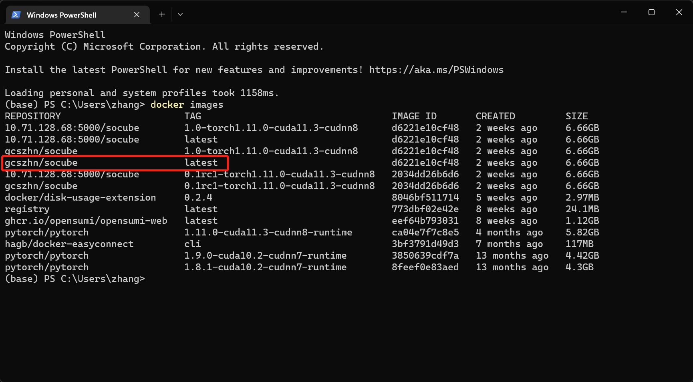

# Usage

## 4.1 Basic use

### 1. Format of input data

SoCube's data input is a scRNA-seq UMI count matrix with rows of cells, columns of genes, and values of UMI counts. SoCube accepts two data formats: (1)DataFrame objects in **HDF5 format** saved in Python pandas library; (2)AnnData objects in **H5AD** format (a customized HDF5 format) saved in Python anndata library. People working in the field of single-cell omics have some basic knowledge of data processing, so this manual does not specifically describe how to convert from other formats to the above formats.

### 2. Running SoCube

SoCube runs under the terminal like the aforementioned pip. The advantage is that it can run on many servers without GUI pages and is not limited by the GUI. Assuming that the input file is "D:\data\pbmc-1C-dm.h5ad", you can enter the following command in the terminal to run the software, and then you will see the software start and output logs in the terminal. The parameter -i (or --input) indicates the specified input file.
```powershell
socube --input "D:\data\pbmc-1C-dm.h5ad"
```


When the software is finished, the doublet detection results and the intermediate files will be put together with the input files by default, resulting in the embedding, plots, models, and outputs folders. The final results are in a CSV file starting with "final\_result" in the "outputs/your model ID/" folder. Open it with Excel spreadsheet software, and you can see that it has three columns as shown below. The first column is the name of the cell sample entered, determined by the user's input; the second column is the probability value of SoCube predicting the sample to be a doublet, ranging from 0\ to 1; the third column is SoCube's prediction of the type based on the probability threshold given by the user or the default threshold of 0.5, with singlet being a single normal cell and doublet being a doublet.Users can either use the probability values for subsequent custom filtering or use the third column for direct filtering.


## 4.2 GPU accelerated computing

If you has a discrete NVIDIA graphics card and the correct CUDA configuration, you will receive the message "Using CPU training, but GPU is available, specify '-gpu-ids ' to use GPU". You only need to add the parameter "-gpu-ids" to the previous command to specify the GPU to be used. The GPU ID can be seen in the output of the nvidia-smi command mentioned earlier, 0,1,2,... which means the 1st, 2nd, 3rd... GPUs respectively (in the case of multiple GPUs)
```powershell
socube -i "D:\data\pbmc-1C-dm.h5ad" --gpu-ids "0,1"
```

## 4.3 Docker-based use

The docker-based use is essentially the same as the previously mentioned use after pip installation, but requires docker to start the container, so there are some differences. Where "-v", "--gpus", "--name" are all start parameters of `docker run` command, " -v" parameter mounts the external folder to the internal path of the docker container. Remember not to forget, because socube reads the file path inside the docker container. The "--gpus" parameter is responsible for authorizing the number of gpu used by the container.



```powershell
sudo docker run -v D:/data:/workspace/datasets `
       –gpus all `
       –name socube `
       gcszhn/socube:latest `
       -input "datasets/pbmc.h5ad" `
       –gpu-ids "0,1"
```



```bash
sudo docker run -v /data:/workspace/datasets \
       –gpus all \
       –name socube \
       gcszhn/socube:latest \
       -input "datasets/pbmc.h5ad" \
       –gpu-ids "0,1"
```



The image name is “gcszhn/socube:latest”, the former one is the docker startup parameters, including folder mapping and GPU mounting, and the latter one is the SoCube parameters, which are used in the same way as before. Users can check the image name through `docker images`.



## 4.4 Use of colab

Google offers a free online machine learning platform with GPU [colab](https://colab.research.google.com/). Users can upload `socube_colab.ipynb` (available in the open source repository of this project) and scRNA-seq data to your [google drive](https://drive.google.com/) and use it for GPU-accelerated prediction. (Tip: you need to choose to enable GPU inside the notebook settings, the default is for CPU).


## 4.5 Multi-process training

With sufficient video memory, users can use the --enable-multiprocess parameter to enable multiprocess training acceleration.
```bash
socube -i your_sc.h5ad -o your_sc --gpu-ids 0 --enable-multiprocess
```
