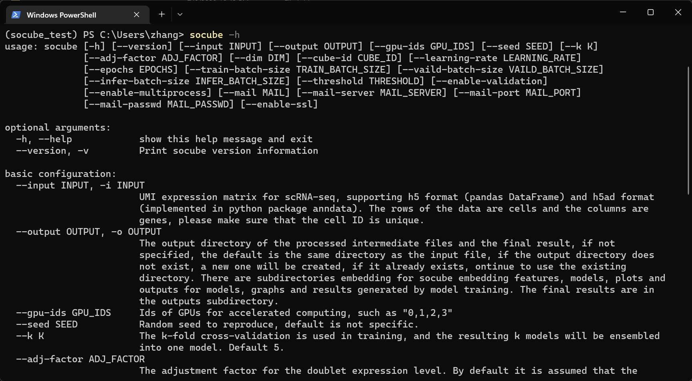

# Parameters

SoCube's parameters help can be obtained by executing `socube --help` in the terminal, which is explained here. socube's help file output will automatically select Chinese or English depending on the user's system language and locale. If necessary, the user can change the system language setting to switch, for example, setting the `LC_ALL` environment variable to `en_US` under linux.

- --help

The abbreviation is "-h". Get above parameter usage help.

- --version

The abbreviation is "-v". Print SoCube's version and copyright.

- --input

The abbreviation is "-i". As mentioned before, this parameter is used to specify the data input file, which can receive two data formats, and it will not be repeated here.

- --output

The abbreviation is "-o". This parameter is used to customize the output path of the result, which will be created automatically if the path does not exist. As mentioned before, by default, the result output will be in the same directory as the input file, and the user can use this parameter to customize it. Example: `--output D:/data/`.

- --gpu-ids

As mentioned before, this parameter is used to specify the serial number of the GPU devices involved in the compute acceleration. It can be a single serial number or multiple serial numbers separated by commas, note that the comma is an English comma with no spaces, the default is not set, use CPU. Example: `--gpu-ids 0,1,2`.

- --seed

This parameter is used to specify the random number seed for the random process in the software calculation, the default is not set. Example: `--seed 4067`.

- --k

This parameter is used to specify the k value for model k-fold cross-training, the default is 5. Example: `--k 4`.

- --adj-factor

This parameter is the adjustment factor for the doublet expression level. By default, the expression level of the doublet is assumed to be twice that of the singlet, but there are fluctuations in the actual situation and the expression level can be changed by adjusting this factor. The default is 1.0. Example: `--adj-factor 0.8`.

- --dim

This parameter is used to specify the number of channels for constructing features, and also the target dimension for gene feature reduction, the default is 10. Example: `--dim 5`.

- --cube-id

This parameter is used to reuse the previously generated features. All features will be saved in the "embedding" subdirectory. This parameter is the ID of the specific feature in that subdirectory, which is a "XXXXXXX-XXXXXX-XXX" style string. Example: `--cube-id 20220704-120122-854`.

- --only-embedding

The user may simply want to use the SoCube feature embedding strategy but does not need to detect and remove the doublets, using this parameter means embedding only.

- --learning-rate

The abbreviation is "-lr". This parameter is the training learning rate of an artificial intelligence deep neural network. This parameter can have a significant impact on the detection results. The default value is 1e-3, and can be customized if necessary. Example: `--learning-rate 1e-4`.

- --epochs

The abbreviation is "-e". This parameter refers to the maximum number of rounds of neural network training. However, in general, training will be completed before the default maximum number of rounds of 100 is reached. Example: `--epochs 50`.

- --train-batch-size

This parameter is used to specify the batch dataset size for neural network training, the default is 64. larger batch data set size tends to have better training effect, but occupies more CPU memory or GPU video memory. Users can adjust it according to the actual situation of their devices. Example: `--train-batch-size 32`.

- --valid-batch-size

Similar to the previous, this parameter is used to specify the batch dataset size for neural network validation and defaults to 512. Since the validation process consumes significantly less memory than the training process, the default value is larger. Example: `--valid-batch-size 256`.

- --infer-batch-size

Similar to the previous, this parameter is used to specify the batch dataset size for neural network prediction, default is 400. example: `--infer-batch-size 256`.

- --threshold

The abbreviation is "-t". This parameter is used to specify the probability threshold for classifying doublets and singlets, the default is 0.5. As explained in the previous CSV results file, cell samples larger than the threshold are determined to be doublets. Example: `-t 0.5`.

- --enable-validation

The abbreviation is "-ev". This parameter is a position parameter with no subsequent values. Use it to enable result validation, which is used only to reproduce the evaluation metrics of the results. It requires that the data input format is H5AD and that the "obs" property of the AnnData object has a "type" column with the content "doublet " or "singlet", which indicates the real label of the dataset.

- --enable-multiprocess

The abbreviation is "-mp". This parameter is a position parameter with no subsequent values. Use it to enable multi-process training. In this case, SoCube creates k sub-processes to train k sub-models in parallel (the k value is specified by the --k parameter). Multi-process training can improve the detection speed, but it is a space-for-time operation, which increases memory and video memory overhead, so users need to decide whether to enable multi-process according to their dataset size and memory size. Of course, users can adjust the previous batch parameter to reduce memory usage.

- --mail

This parameter specifies the email address to be used for result notification, which can be used by any mail provider that supports SMTP protocol, such as QQmail, Gmail, etc. It needs to be used in conjunction with several subsequent mailbox parameters.

- --mail-server

This parameter specifies the SMTP server domain name of the mail provider. Please consult the email provider you are using for details. Example: `--mail-server smtp.gmail.com`.

- --mail-port

This parameter specifies the SMTP service port of the mail provider. Please consult the email provider you are using for details. Example: `--mail-port 994`.

- --mail-passwd

This parameter specifies the password of the email. Generally it is the login password of web email, unless otherwise agreed by the email provider, please consult the email provider you are using for details.

- --enable-ssl

Enabling this parameter means that the mail service uses SSL encryption.