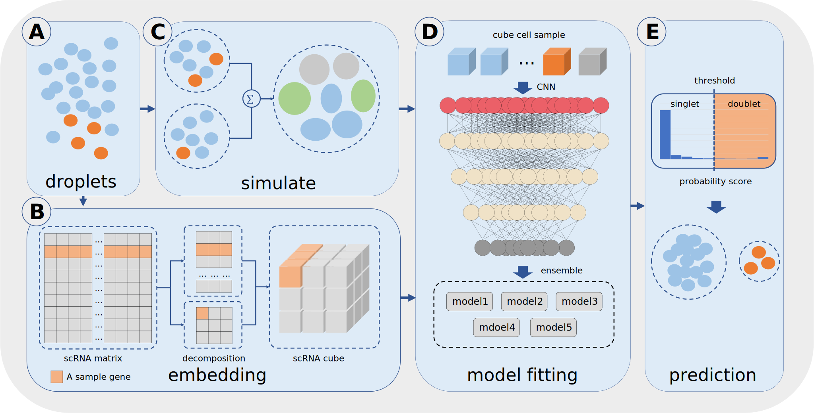

# Introduction

## 1.1 Basic Information

SoCube V1.1 is terminal command-based software written in Python without a graphical user interface (GUI), and can run on any server, personal computer, which can run the Python program.

## 1.2 Writing Purpose

This gitbook is a user's guide for SoCube V1.1. It will introduce the requirement, installment and usage of SoCube V1.1. Besides, it provides some common problems' solutions when using SoCube.

## 1.3 Background

High-throughput single-cell RNA sequencing (scRNA-seq) is widely used in biomedical research [1-6]. However, due to the limitations of sequencing technology, some doublets (or multiplets) formed by the combination of two (or more) cells will be generated during the sequencing process. Doublets are equivalent to the cell types not present in the sample and can severely interfere with the true statistical distribution of cells and genes, thus affecting distribution-dependent downstream studies [7]. Therefore, the Laboratory of Innovative Drug Research and Bioinformatics at Zhejiang University (hereinafter referred to as "we") developed SoCube to detect doublets generated in single-cell high-throughput sequencing.
