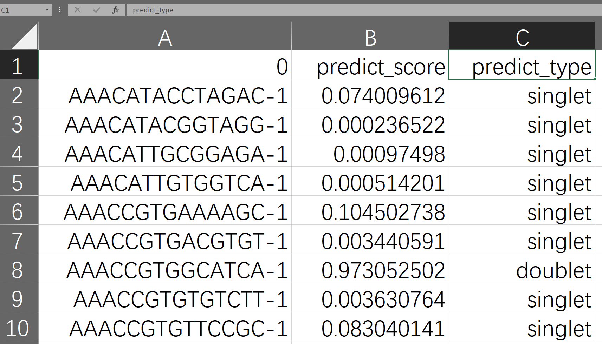
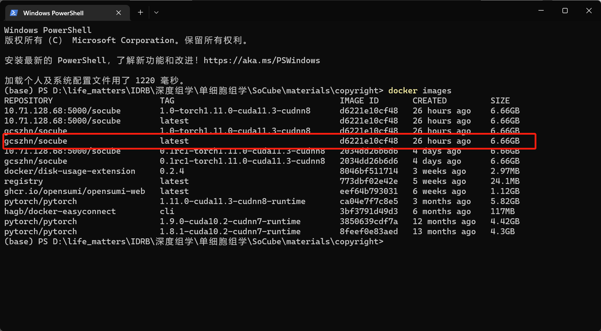

# 软件使用

## 4.1 基本使用
### 1. 准备输入数据的格式
SoCube的数据输入是scRNA-seq的UMI计数矩阵，其行为细胞，列为基因，值为UMI计数。SoCube接受两种数据格式：（1）Python pandas库保存的**HDF5格式**DataFrame对象；（2）Python anndata库保存的**H5AD格式**（一种定制化的HDF5格式）AnnData对象。从事单细胞组学领域研究的人都具有一定的数据处理基础，因此本手册不具体介绍如何从其他格式转化为上述格式。
### 2. 运行SoCube
SoCube和前面提到的pip一样，运行于终端下，这样的优势在于可以运行在很多没有GUI页面的服务器上，而不受GUI限制。假设输入文件为"D:\data\pbmc-1C-dm.h5ad"，则可以在终端输入下面命令运行软件，然后就会看到软件启动并在终端输出日志。参数-i（或者--input）表示指定输入文件。
```powershell
socube --input "D:\data\pbmc-1C-dm.h5ad"
```


等待软件运行完毕，二聚体检测结果以及中间文件默认会和输入文件放在一起，产生embedding、plots、models、outputs这几个文件夹。其中最终结果在“outputs/你的模型ID/”文件夹下以“final\_result”开头的CSV文件中。用Excel电子表格软件打开，可以看到其有下图三列。第一列是输入数据的细胞样本名称，由用户的输入决定；第二列是SoCube预测该样本为二聚体的概率值，大小介于0\~1之间；第三列是SoCube基于用户给定概率阈值或者默认阈值0.5得出的类型预测，singlet即单体正常细胞，doublet即二聚体。用户既可以使用概率值进行后续自定义筛选，也可以利用第三列进行直接筛选。



## 4.2 GPU加速运算
如果用户拥有独立NVIDIA显卡并配置了正确的CUDA，会收到“Using CPU training, but GPU is available, specify ‘—gpu-ids’ to use GPU”的提示。用户只需要在前述命令的基础上，增加指定参数“—gpu-ids”来指定要使用的GPU。GPU的ID可以在前面说到的nvidia-smi命令输出中看到，0,1,2，…分别表示第1,2,3…块GPU（多块的GPU的情况下）
```powershell
socube -i "D:\data\pbmc-1C-dm.h5ad" --gpu-ids "0,1"
```

## 4.3 基于docker的使用

和前面pip安装后使用本质上一样的，但需要通过docker来启动并进入容器，因此有额外步骤`docker run`启动容器以及`docker exec`进入容器。其中“-v”、“--gpus”，“--name”都是`docker run`命令的启动参数，“-v”参数将外部文件夹挂载到docker容器内部路径，请务必不要忘了加这个参数。因为socube读取的是docker容器内的文件路径。“--gpus”参数负责对容器使用gpu数量进行授权。进入容器后即可正常使用socube命令。



```powershell
# 创建容器
docker run -v D:/data:/workspace/datasets `
       –gpus all `
       –name socube `
       gcszhn/socube:latest

# 进入容器
docker exec -it socube bash
```



```bash
# 创建容器
sudo docker run -v /data:/workspace/datasets \
       –gpus all \
       –name socube \
       gcszhn/socube:latest

# 进入容器
sudo docker exec -it socube bash
```



其中“gcszhn/socube:latest”是镜像名称，前面的是docker启动参数，包括文件夹映射和GPU挂载，后面即SoCube的参数，使用与前文一致。用户可以通过`docker images`来查看镜像名称。



## 4.4 colab使用
谷歌提供了一个免费的带有GPU的在线机器学习平台[colab](https://colab.research.google.com/)。用户可以上传`socube_colab.ipynb`（在本项目的开源仓库中提供了）和scRNA-seq数据到你的[google drive](https://drive.google.com/)，并使用其进行GPU加速预测。(温馨提示：需要在notebook设置里面选择启用GPU，默认是CPU的)


## 4.5 多进程训练
在内存与显存都充足的情况下，用户可以使用--enable-multiprocess参数来启用多进程训练加速，充分发挥现代CPU的多核计算优势。
```bash
socube -i your_sc.h5ad -o your_sc --gpu-ids 0 --enable-multiprocess
```


