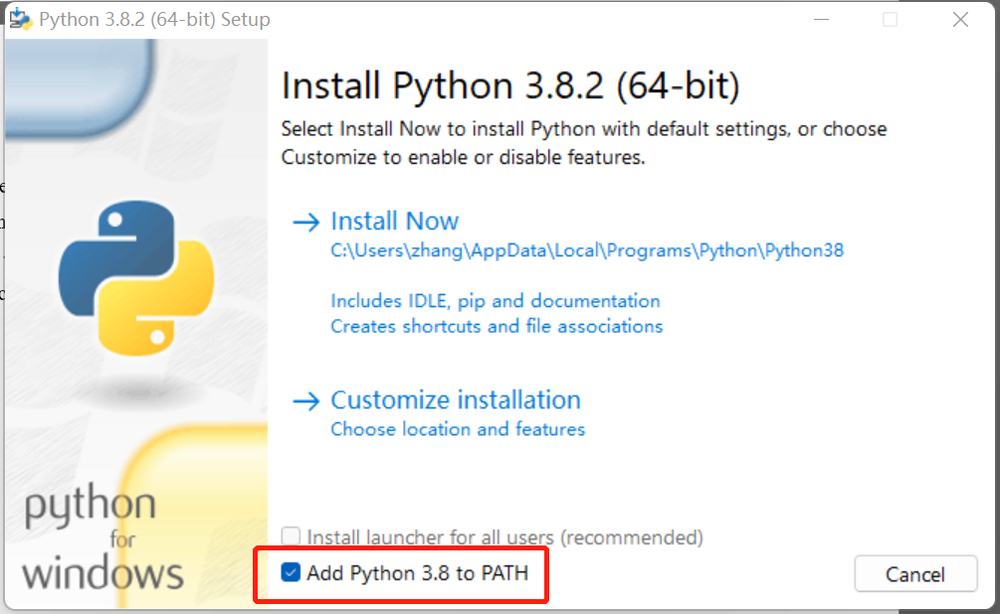

# 软件安装

## CUDA安装

SoCube是基于深度卷积神经网络开发的，我们强烈建议用户在有NVIDIA GPU和NVIDIA CUDA计算套件的环境下，使用GPU加速计算。对于拥有支持CUDA的NVIDIA GPU，用户首先需要安装CUDA，这个可以从[NVIDIA官网](https://developer.nvidia.com/cuda-toolkit-archive)下载并安装。


安装完成后，用户可以在终端输入“nvidia-smi”，即可查看自己的显卡信息以及CUDA版本信息，如下图的显卡为GeForce RTX 3060，驱动版本为516.59，CUDA版本为11.7。

```powershell
nvidia-smi
```


## SoCube安装



```bash
pip install socube # pip安装
socube -v # 查看安装版本
```

SoCube已经打包发布到Python官方仓库[PyPi](https://pypi.org/project/socube/)，用户可以打开终端（如Windows PowerShell，Bash等），使用pip命令安装。对于国内用户，建议在安装时使用清华大学镜像源加速下载。下面以Windows操作系统为例介绍。

### 1. 安装Python语言

SoCube是基于Python语言开发的软件，需要依赖Python解释器来运行软件，因此需要安装。用户需要从[Python官网](https://www.python.org/getit/)下载Python。


如下图，按安装包提示安装Python，并勾选将Python添加到PATH环境变量（该环境变量定义了终端命令的搜索路径，没有添加则无法直接在终端中使用Python）。



### 2. 打开终端命令环境

Pip是一个Python提供的包管理器，可以下载各类Python开发的软件包，但它需要在终端中使用。Windows下提供了Windows PowerShell和Cmd两种终端，我们推荐使用PowerShell。使用“Win+R”快捷键并运行powershell快速进入PowerShell终端。


### 3. 执行pip命令安装

在终端中执行前述命令安装SoCube V1.0，其中对国内用户推荐使用清华大学镜像源加速软件下载。当看到“Successfully installed \*\*\* socube-1.0”即表示下载安装成功。安装成功后继续在当前终端输入`socube -v`可以看到软件版本提示。国内用户推荐使用-i参数指定清华大学镜像源https://pypi.tuna.tsinghua.edu.cn/simple/。





```bash
docker pull gcszhn/socube:latest
```

Docker是一种容器化的技术，它将软件隔离在一个沙盒中，称之为容器。容器与物理设备（称为容器的宿主机）之间、容器与容器之间均为相互隔离的状态。容器内拥有应用运行的完整软件环境而完全不依赖于宿主机的软件环境。容器可以作为镜像发布并在安装有docker的设备之间共享而无需额外的安装。SoCube已经构建了docker镜像，并发布在[Docker Hub](https://hub.docker.com/repository/docker/gcszhn/socube)。已经安装docker的用户可以在终端中执行上述命令获取SoCube。



