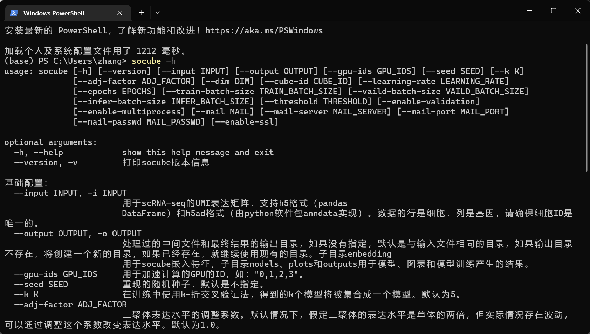

# 软件使用

### 4.1 基本使用

（1）准备输入数据的格式

SoCube的数据输入是scRNA-seq的UMI计数矩阵，其行为细胞，列为基因，值为UMI计数。SoCube接受两种数据格式：（1）Python pandas库保存的**HDF5格式**DataFrame对象；（2）Python anndata库保存的**H5AD格式**（一种定制化的HDF5格式）AnnData对象。从事单细胞组学领域研究的人都具有一定的数据处理基础，因此本手册不具体介绍如何从其他格式转化为上述格式。

（2）运行SoCube

SoCube和前面提到的pip一样，运行于终端下，这样的优势在于可以运行在很多没有GUI页面的服务器上，而不受GUI限制。假设输入文件为"D:\data\pbmc-1C-dm.h5ad"，则可以在终端输入下面命令运行软件，然后就会看到软件启动并在终端输出日志。参数-i（或者--input）表示指定输入文件。

```powershell
socube --input "D:\data\pbmc-1C-dm.h5ad"
```


等待软件运行完毕，二聚体检测结果以及中间文件默认会和输入文件放在一起，产生embedding、plots、models、outputs这几个文件夹。其中最终结果在“outputs/你的模型ID/”文件夹下以“final\_result”开头的CSV文件中。用Excel电子表格软件打开，可以看到其有下图三列。第一列是输入数据的细胞样本名称，由用户的输入决定；第二列是SoCube预测该样本为二聚体的概率值，大小介于0\~1之间；第三列是SoCube基于用户给定概率阈值或者默认阈值0.5得出的类型预测，singlet即单体正常细胞，doublet即二聚体。用户既可以使用概率值进行后续自定义筛选，也可以利用第三列进行直接筛选。


（3）GPU加速运算（如果设备拥有独立NVIDIA显卡）

如果用户配置了正确的CUDA，会收到“Using CPU training, but GPU is available, specify ‘—gpu-ids’ to use GPU”的提示。用户只需要在前述命令的基础上，增加指定参数“—gpu-ids”来指定要使用的GPU。GPU的ID可以在前面说到的nvidia-smi命令输出中看到，0,1,2，…分别表示第1,2,3…块GPU（多块的GPU的情况下）

```powershell
socube -i "D:\data\pbmc-1C-dm.h5ad" --gpu-ids "0,1"
```

（4）基于docker的使用

和前面pip安装后使用本质上一样的，但需要通过docker来启动容器，因此有一定区别。



```powershell
docker run -v D:/data:/workspace/datasets `
       –gpus all `
       –name socube `
       gcszhn/socube:latest `
       -input "datasets/pbmc.h5ad" `
       –gpu-ids "0,1"
```



```bash
docker run -v /data:/workspace/datasets \
       –gpus all \
       –name socube \
       gcszhn/socube:latest \
       -input "datasets/pbmc.h5ad" \
       –gpu-ids "0,1"
```



其中“gcszhn/socube:latest”是镜像名称，前面的是docker启动参数，包括文件夹映射和GPU挂载，后面即SoCube的参数，使用与前文一致。用户可以通过`docker images`来查看镜像名称。


### 4.2软件参数详解

SoCube的所有软件参数帮助可以在终端执行`socube --help`得到，这里对它进行详解。



（1）--input

简写为“-i”。如前所述，该参数用于指定数据输入文件，可以接收两种数据格式，这里不再赘述。

（2）--output

简写为“-o”。该参数用于自定义结果的输出路径，路径不存在会自动创建。如前所述，默认情况下，结果输出会与输入文件在相同目录，用户可以使用该参数来自定义。例：--output D:/data/

（3）--gpu-ids

如前所述，该参数用于指定参与计算加速的GPU设备序号。可以是单个序号，也可以是以逗号分隔的多个序号，注意逗号为英文逗号且无空格，默认不设置，使用CPU。例：--gpu-ids 0,1,2。

（4）--seed

该参数用于指定软件计算中随机过程的随机数种子，默认为不设置。例：--seed 4067。

（5）--k

该参数用于指定模型k折交叉训练的k值，默认为5。例：--k 4。

（6）--adj-factor

该参数二聚体表达水平的调整系数。默认情况下，假定二聚体的表达水平是单体的两倍，但实际情况存在波动，可以通过调整这个系数改变表达水平。默认为1.0。例：--adj-factor 0.8。

（7）--dim

该参数用于指定构建特征的通道数，也是基因特征降维的目标维数，默认为10。例：--dim 5。

（8）--cube-id

该参数用于复用此前产生的特征。所有特征会保存在embedding子目录下。该参数即为该子目录下具体特征的ID，为“XXXXXX-XXXXXX-XXX”样式的字符串。。例：--cube-id 20220704-120122-854.。

（9）--learning-rate

简写为“-lr”。人工智能深度神经网络的训练学习率。该参数对检测效果会有显著影响。默认值为1e-3，如果用户觉得有必要，可以自定义。例：--learning-rate 1e-4。

（10）--epochs

简写为“-e”。该参数指的是神经网络训练的最大轮数。但一般而言，会在达到默认最大轮数100前完成训练。例：--epochs 50。

（11）--train-batch-size

该参数用于指定神经网络训练的批次数据集大小，默认为64。批次数据集大小较大，训练效果往往较好，但占用CPU内存或者GPU显存较大。用户可以根据自己设备实际情况做出调整。例：--train-batch-size 32。

（12）--valid-batch-size

与前类似，该参数用于指定神经网络验证的批次数据集大小，默认为512。因为验证过程比训练过程的内存消耗显著较小，因此默认值较大。例：--valid-batch-size 256。

（13）--infer-batch-size

与前类似，该参数用于指定神经网络预测的批次数据集大小，默认为400。例：--infer-batch-size 256。

（14）--threshold

简写“-t”。该参数用于指定分类二聚体与单体的概率阈值，默认为0.5。正如前面CSV结果文件的解释，大于阈值的细胞样本会被判定为二聚体。例：-t 0.5。

（15）--enable-validation

简写“-ev”。该参数是位置参数，无后续值。使用它表示启用结果验证，该功能仅用于复现结果的评估指标。使用时要求数据输入格式为H5AD格式，且在其AnnData对象的“obs”属性中有“type”列，内容为“doublet”或“singlet”，表示该数据集的真实标注。

（16）--enable-multiprocess

简写“-mp”。该参数是位置参数，无后续值。使用它表示启用多进程训练。此时SoCube会创建k个子进程来并行训练k个子模型（k值由—k参数指定）。多进程训练可以提高检测速度，但是属于空间换时间，会增大内存和显存开销，因此用户需要根据自己的数据集大小与内存大小判断是否开启多进程。当然用户可以调节前面的批次参数来降低内存占用。

（17）--mail

该参数指定了用于结果通知的邮箱地址，任何支持SMTP协议的邮件供应商都可以使用，例如QQ邮箱、Gmail等。需要和后续几个邮箱参数配合使用。

（18）--mail-server

该参数指定了邮件供应商的SMTP服务器域名。具体请咨询您所使用的邮箱供应商。例：--mail-server smtp.gmail.com。

（19）--mail-port

该参数指定了邮件供应商的SMTP服务端口。具体请咨询您所使用的邮件供应商。例：--mail-port 994。

（20）--mail-passwd

该参数指定了邮箱的密码。一般就是网页邮箱的登录密码，但邮件供应商另有约定的除外，具体请咨询您所使用的邮件供应商。

（21）--enable-ssl

启用该参数代表邮件服务使用SSL加密。
